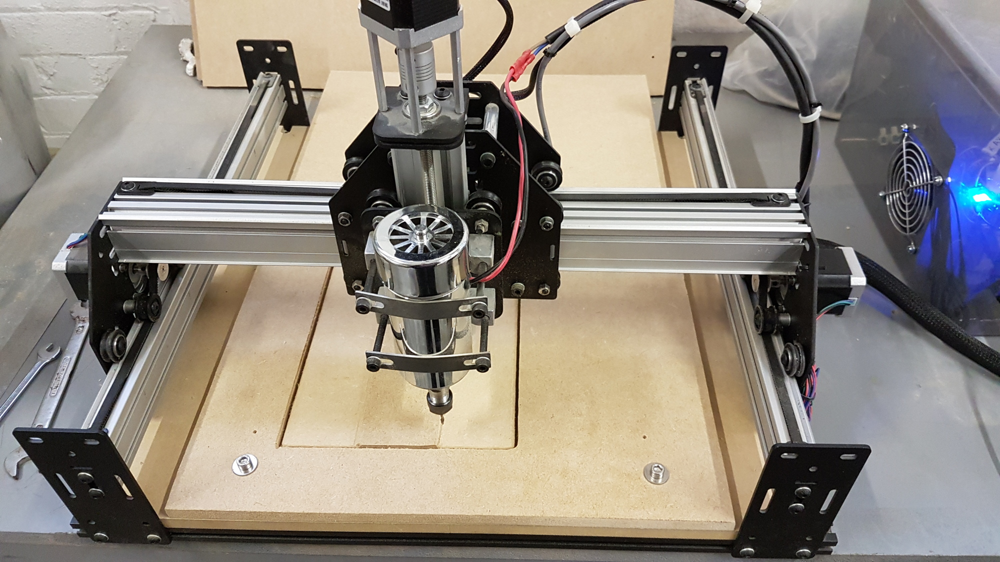
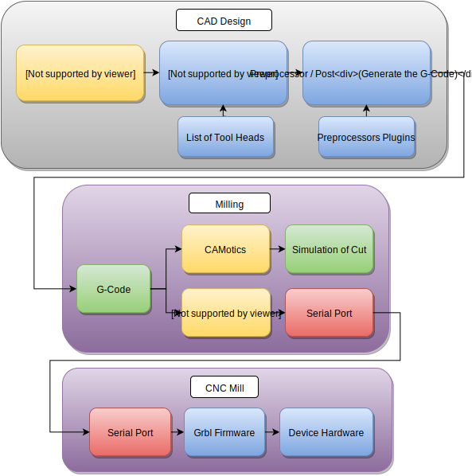

# Hacman - Shapeoko 2

## Overview

This is a series of Docs for the use of the Shapeoko 2 currently within the Hackspace.  
This is currently on loan to us from Simon.
(Many thanks to Simon for the loan of the shapeoko, and Bob for the spindle PSU)

The docs are largley split into 3 sections

  * **CAD / CAM** - First use the CAD / CAM Headings to create the G-Code
  * **Milling** - once you have the G-Code to run on the mill use this section to carry out the milling
  * **Maintenance** - Note for future upgrates etc

  

## WorkFlow

  * You design your part in Cad software or as a vector diagram / inkscape etc
  * You pass the design into CAM software which plots out the paths needed to mill the part (similar to a 3D Printer slicer)
  * You run the generated G-Code on the mill (generally via chillipepr)

The post processor is usually a part of the Cam software that generates G-Code for specific types of CNC.
This could include one processor for Grbl, another for TinyG. Generally if there's a post processor for LinuxCNC then this should work with grbl.

## Software

### Open Source Software

  * **[JSCut](http://jscut.org/)** - Easiest to use Open source Cam software, limited to 2.5 CAM / 2 dimensional profiles similar to a laser cutter
  * **[FlatCAM](http://flatcam.org/)** - PCB Milling via G-Code, this is one of the few PCB to G-Code softwares that has a GUI.
  * **[PyCAM](http://wiki.linuxcnc.org/cgi-bin/wiki.pl?Cam)** - Can handle STL Files and generate 3D Cam profiles, but seems not to be updated often
  * **[FreeCad](http://www.freecadweb.org/wiki/index.php?title=Path_Workbench)** - Path workspace, this is the closest match to Soldiworks in the open source world and has support for importing openscad files
  * **[HeeksCad / HeeksCNC](https://github.com/Heeks/heekscad)**

### Free / Non open source software

  * **[Autodesk Fusion 360 CAM / Cad](http://cam.autodesk.com/fusion360/)**

### Commercial Software

The top two items of commercial CAM software for use with Solidworks includes Hsmworks and MasterCam.
Hsmworks is by far the easiest to use, but not to good at turning or 4 / 5 Axis.
MasterCam has the most features but is much more difficult to use.

  * **[HsmWorks / Solidworks](http://www.hsmworks.com/)** - Milling Solid 3D parts
  * **[MasterCam / Solidworks](http://www.mastercam.com/en-us/Solutions/Integrated-CAD-Solutions/Mastercam-for-SOLIDWORKS)** - Milling Solid 3D parts
  * **[Aspire](http://www.vectric.com/cool-stuff/projects/2013/bread-box.html)** - Milling graphical / artwork type patterns such as lettering or meshes.
